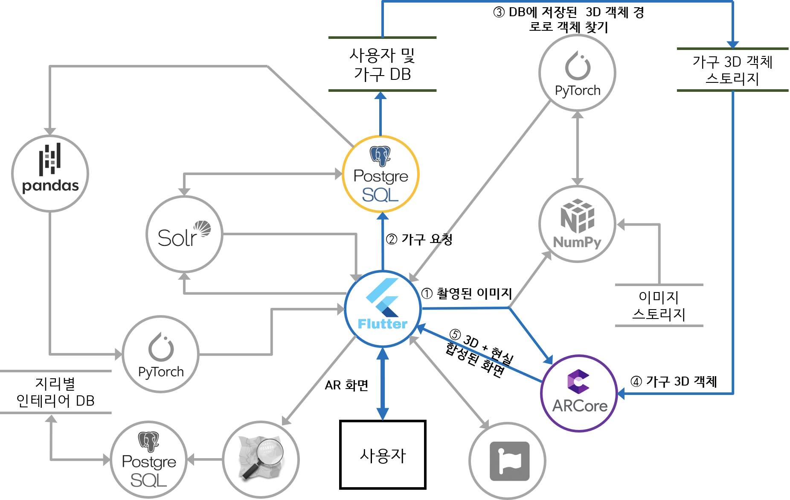
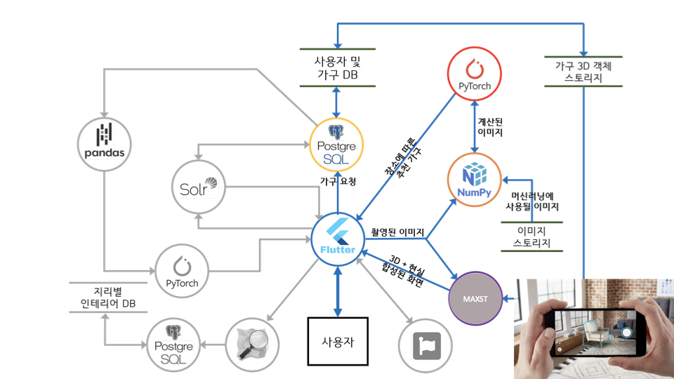
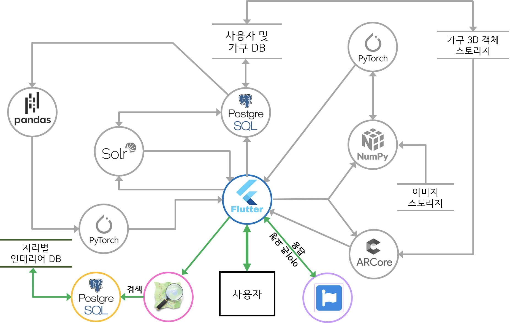
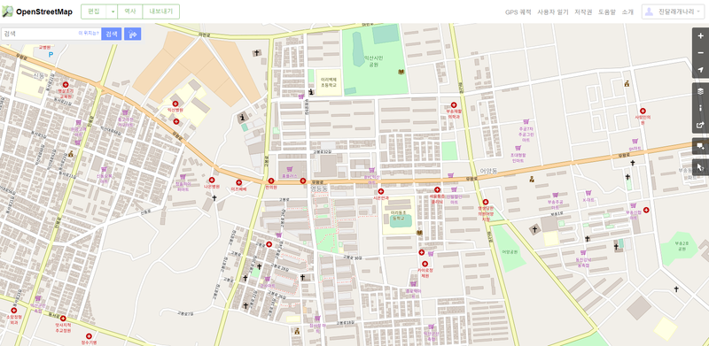
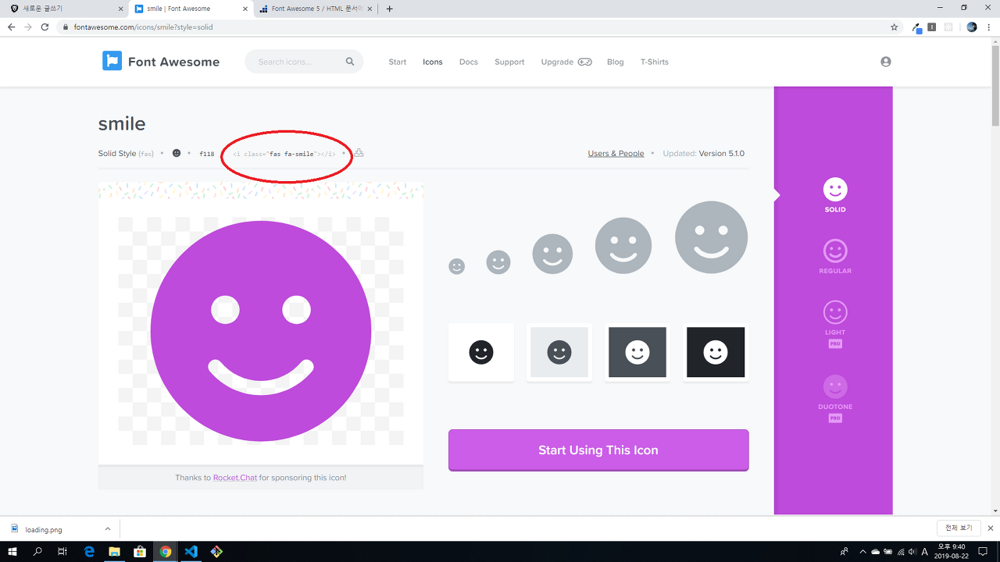

# OS Final Report

# 오픈소스 최종 보고서

### 5.4. 3D 모델링 객체 불러와서 인테리어 배치

ARCore, MAXST

- 기능 활용도
    - 사용자가 필요한 가구를 구매하려고 할 때 그 크기가 가격으로 인한 부담 때문에 구매 여보에 대한 확신이 들지 않을 때, 혹은 인터리어 적으로 어울릴지에 대한 확신이 들지 않을 때나 집 안에 장소 구조를 고려하여 배치 하는게 부담이 될 때 해당 기능이 도움이 될 것이라 예상됩니다. 
- 선정 이유
    - AR 오픈소스 중 많이 알려진 오픈소스이고 Android뿐만 아니라 ios도 지원하기 때문에 선정하게 되었습니다.
- 진행 Flow1
    - 사용자가 관심을 가지고 있는 가구 혹은 PyTorch에서 제시한 장소에 따른 추천 가구 등을 “사용자 및 가구 DB”에 저장합니다.
    - 가구 정보가 들어있는 database를 토대로 해당 가구들을 3D 모델링화 시켜서  “가구 3D 객체 스토리지”에 저장합니다.
    - 저장되어있는 3D 객체 가구를 불러와서 ARCore를 통해 사용자가 원하는 위치에 배치해보면서 인테리어 시뮬레이션을 진행합니다.
        - ARCore는 모션추적, 환경인식, 조명추정의 3가지 주요 기능을 사용하여 스마트폰의 카메라를 통해 가상 현
        실을 실제 세계와 통합하여 AR을 구현합니다.
- 진행 Flow2
    - 사용자가 가구를 배치하려고 휴대폰으로 공간을 촬영하기 시작합니다.
    - 배치하고자하는 가구를 저장되어있는 3D 객체 가구에서 불러와서 ARCore를 통해 사용자가 원하는 위치에 배치해보면서 인테리어 시뮬레이션을 진행합니다.

- 추가 기능
    - 해당 기능은 오픈소스를 이용해서 구현 할 기능이 아니기 때문에 별도의 기능으로 빼서 추가로 넣었습니다.
    - 오늘의 집에서 어토스케치 업체와 협업하여 3D인테리어 기능을 제공해주는 방식과 마찬가지로 MAXST에서 제공하고 있는 여러 증강현실 기능 중 현실에 있는 물체를 즉시 3D모델링 시켜서 증강현실 속 물체로 반영시켜주는 기능을 활용하여 제공해주고자 합니다.
    - 기능 활용도
        - 사용자가 가지고 있는 가구를 재배치하고자 할 때 가구 배치에 대한 고민을 덜어줄 수 있는 부분에서 해당 기능이 유용하게 쓰일거라 예상합니다.
    - 진행 Flow
        - 사용자가 가지고 있는 가구를 휴대폰으로 촬영하기 시작합니다.
        - 촬영되고 있는 이미지 객체를 MAXST에서 제공해주는 기능을 활용하여 즉시 가구 3D 모델링 제작을 시작합니다.
        - 모델링 된 가구를 현실과 합성하여 가구 재배치할 수 있습니다.

### 5.5. 사용자 위치 정보를 바탕으로 인근 사용자들의 인테리어 탐색

OSM

- 기능 활용도
    - 사용자 위치 정보를 바탕으로 인근에 거주중인 다른 사용자들의 인테리어를 참고하고자 할 때 혹은 비슷한 집 구조에서의 인테리어를 참고하고자 할 때 유용하게 쓰일것이라 예상합니다.
    - 지도 내 실내 인테리어를 직접 띄워주는 것이 아닌 인근에 비슷한 집 구조를 가진 인테리어가 어느정도 있는지, 사용자는 어느정도 있는지를 파악하고 지도에 해당 인테리어를 볼 수 있도록 이동할 수 있는 url정보를 아이콘 형태로 띄우는 정도로 해당 오픈소스를 활용할 예정입니다.

- 선정 이유
    - 상용화된 구글이나 카카오 API 등 더 좋은 기능을 제공할 수 있는 구현 방법이 있지만 오픈 소스만을 이용하여 해당 프로젝트를 완성시키고자 하였습니다.
    - 저장한 database를 바탕으로 누구나 자유롭게 편집 가능한 무료배포 서비스인 OSM이 본 프로젝트 서비스와 어울린다고 판단하였습니다.
    - 다양한 OpenGL 3D Graphics Library 와 결합이 가능해서 3D 지도 제작 기능을 쉽게 넣을 수 있습니다.
- 진행 Flow1
    - 지리별로 인테리어 정보들을 database에 저장합니다.
    - 사용자가 본인이 관심있는 지역의 인근 인테리어 정보들을 알아보고자 OSM에 접속하여 검색을 요청합니다.
    - OSM에서 사용자의 검색으로 들어온 지역의 인근 인테리어 정보를 “지리별 인테리어 DB”에서 탐색하여 응답을 보냅니다.
    

### 5.6.UI 아이콘 제작

Font-Awesome

- 기능 활용도
    - 사용자가 보기 쉽게 프론트 UI 작업에 필요한 아이콘을 다체롭게 제공하는데 쓰일 예정입니다.

- 선정 이유
    - 웹에서 아이콘이 필요할 때 가장 많이 사용되는 라이브러리이고 Solid, Regular, Light 등 하나의 아이콘에 다양한 변형 버전 제공 및 사이즈 변경이 가능하기 때문에 원하는데로 수정이 가능합니다.