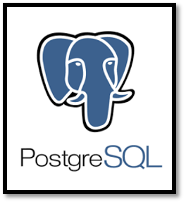

# 발표할 오픈소스 세부조사

Date Created: November 17, 2022 12:37 PM
Status: 진행 중

1. 오픈소스 (8페이지)
    - 정의
    - 라이선스(등급)
    - 선정 이유(기능) 및 활용 계획
    - 특징
        - 특징이 곧 선정이유는 느낌..?
- Flutter
    
    
    
    [https://github.com/flutter/flutter](https://github.com/flutter/flutter)
    
    라이선스 : BSD License
    
    - BSD License
        
        **BSD 허가서**는 자유 소프트웨어 저작권의 한 가지이다. BSD 계열 소프트웨어를 포함한 많은 프로그램에서 사용한다.
        
        BSD (Berkeley Software Distribution) 라이선스는 소프트웨어 라이선스라고도 할 수 없을 만큼 미약하여, 해당 소프트웨어는 아무나 개작할 수 있고, 수정한 것을 제한 없이 배포할 수 있다. 다만 수정본의 재배포는 의무적인 사항이 아니므로 BSD 라이선스를 갖는 프로그램은 공개하지 않아도 되는 상용 소프트웨어에서도 사용할 수 있다.
        
        BSD 라이선스는 라이선스 자체에는 소프트웨어에 국한되지 않고 하드웨어 등에서도 아무런 제약 없이 누구나 자신의 용도로 사용할 수 있도록 하는 대신 사용자의 사용으로 인해 발생하는 모든 발생가능한 경우의 리스크와 손해에 대해 사전인식가능 여부와 상관없이 사용자 본인에게 책임지고 있다는 점도 이 라이선스의 주요한 부분을 차지하고 있다.
        
    
    선정 이유(기능 및 활용 계획)
    
    - 웹/앱 개발이 모두 가능한 프론트엔드 오픈소스
    - 위젯이 빠르고 자연스럽게 잘 동작하며 커스터마이징과 확장이 쉬움
    
    특징
    
    - Google에서 출시된 모바일/웹/데스크톱 크로스 플랫폼 GUI SDK
    - Dart 언어 사용
    - 하나의 코드 베이스로 안드로이드, 리눅스, Windows, macOS, iOS 및 웹브라우저에서 모두 동작 되는 앱을 위해 출시
    - 개발 비용 절감
    - 플랫폼에 관계없이 플러터용 테마 디자인 라이브러리 적용이나 테마 커스텀 가능
    - 웹 브라우저에서 실행할 수 있으며 보안이 취약한 기존 JS 웹 앱 방식을 대체한 웹 어셈블리 모드로 한 임베드 웹 앱 영역에 사용하기 최적
    - 소스코드를 네이티브로 직접 컴파일하며 UI 자체 렌더링 엔진으로 직접 렌더링하여 좋은 성능
    - OEM 위젯이나 DOM 웹뷰를 사용하지 않고, 자체 위젯을 Canvas 위에 직접 렌더링
    - 위젯이 빠르고 자연스럽게 잘 동작하며 커스터마이징과 확장이 쉬움
    - 간단한 코드로 레이아웃을 그릴 수 있음
    
    적용 사례
    
    - 네이버 지식IN 어플
    
    React Native와의 비교
    
    - Flutter는 Bridge를 거치지 않고 바로 Canvans에 UI를 렌더링하기 때문에 기대 이상의 성능을 보여 준다. 화면 렌더링 시 60fps의 성능이 나올 수 있다면 앱의 동작이 충분히 부드러워 사용성이 좋아지는데, 네이티브 방식과 Flutter, React Native 모두 60fps에 근접한 성능을 보여 준다.
    - 참고 링크:[https://d2.naver.com/helloworld/3384599](https://d2.naver.com/helloworld/3384599)
    
- **PostgreSQL**
    
    ① PostgreSQL(포스트그레스큐엘) : 회원정보등 다양한 데이터 저장
    
    
    [https://github.com/postgres/postgres](https://github.com/postgres/postgres)
    
    라이선스 : PostgreSQL License
    
    - 독자적 라이선스로 MIT 라이선스와 비슷하며, 배포시 소스코드 제공의무가 없음
    - 저작권 고지사항 유지
    - 조합저작물 작성이 가능하고 타 라이선스로 배포 허용이 가능
    - 사용 중 발생하는 문제에 대해 법적 책임이 없을을 명확히 함
    
    선정이유
    
    - 다양한 플랫폼 지원
    - 독자적 라이선스
    - 기본적인 신뢰도와 안정성을 위한 기능뿐만 아니라 진보적인 기능이나 학술적 연구를 위한 확장 기능 등 다양한 기능을 많이 제공
        - Oracle과 유사한 기능을 많이 제공하는데 사용자들이 적응하기는 더 쉬다고 함
    
    특징
    
    - The PostgreSQL Global Development Group에서 개발한 [오픈 소스](https://namu.wiki/w/%EC%98%A4%ED%94%88%20%EC%86%8C%EC%8A%A4) [RDBMS](https://namu.wiki/w/DBMS)
    - 객체-관계형 데이터베이스 시스템(ORDBMS)
    - 클라이언트/서버 모델을 사용하여 서버는 다중 클라이언트 연결을 처리할 수 있음
    - Enterprise급 DBMS기능을 갖추었고 Oracle DB, MySQL, Microsoft SQL에 이어 점유율 4위
    - ANSI C로 개발되었으며 지원하는 플랫폼은 Windows, Linux, MAC OS, Unix 등 다양
    - MySQL에 비해서 SQL 표준을 더 잘 지원하고 기능이 더 강력
    - CRUD 성능이 경쟁 DB에 비해 좋지 않은 편
    - Skype와 인스타그램에서 사용중
    
    기능
    
    - 다양한 데이터베이스 객체를 사용자가 임의로 만들 수 있는 기능을 SQL 차원에서 제공 (연산자, 복합 자료형 집계 함수, 확장 기능 등)
    - 테이블 상속 기능을 이용하여 하위 테이블 생성 가능 (하위 테이블에만 속하는 칼럼 추가로 만들기)
    - 관계형 DBMS의 기본적인 기능인 트랜잭션과 ACID를 지원
    - Citus 익스텐션 이용하면 병렬 인덱싱 손쉽게 처리
    - DB 보안은 데이터 암화화, 접근 제어 및 감시로 구성
    
    ② MariaDB – 라이선스가 GPL로 소스코드 공개 의무
    
    ③ MySQL - 라이선스가 GPL로 소스코드 공개 의무
    
    ④ MongoDB – 라이선스가 SSPL로 서비스 코드를 실행하는데 필요한 코드 공개 의무
    
- 아이콘 오픈소스
    - 프론트엔드 아이콘: Font-awesome
    
    
    [https://www.notion.so](https://www.notion.so)
    
    - 웹 사이트 구축에서 필요한 아이콘들을 사용할 수 있는 무료 오픈소스
    - 저장소: • [github .com /FortAwesome /Font-Awesome](https://github.com/FortAwesome/Font-Awesome)
    - 라이선스
        - *무료* 버전(Font Awesome Free)과 유로버전(Font Swesome Pro)의 두 가지 패키지 제공
        - 최대 4개까지 의 모든 릴리스 및 5개까지의 무료 버전
            - SIL Open Font License 1.1, Creative Commons Attribution 4.0 및 MIT License 에 따라 사용가능
        - 그 외 라이센스:
        
        | 라이센스 | • 아파치 라이선스
        • BSD 라이선스
        • 크리에이티브 커먼즈 라이선스
        • GNU 일반 공중 라이선스 + GPL 글꼴 예외
        • GNU 약소 일반 공중 사용 허가서
        • LaTeX 프로젝트 공중 라이선스
        • MIT 라이센스
        • SIL 오픈 글꼴 라이선스
        • 우분투 글꼴 라이선스 |
        | --- | --- |
    - 특징
        - 웹에서 아이콘이 필요할 때 가장 많이 사용되는 라이브러리
        - Solid, Regular, Light등 하나의 아이콘에 다양한 변형 버전 제공 및 사이즈 변경 가능
        - 현재 Font Awesome 버전 5까지 출시
    - 사용방법
        - 간편한 사용법: html 파일을 열고 `head` 태그 안에 `link` 태그로 CDN 서비스의 URL을 지정해주기만 하면 바로 Font Awesome 5를 사용할 수 있음
- 오픈스트리트맵
    
    오픈스트리트맵(OSM): OpenstreetMap은 무료로 편집 가능한 전 세계의 오픈 콘텐츠 라이센스로 출시된 지도(지리 공간 데이터베이스)이다.
    
    
    라이선스
    
    - 지도 이미지와 편집을 위한 바탕지도 데이터를 무료 (또는 거의 무료) 로 사용하는 것을 허용하고 있다.
        - 라이런스 설명 링크: [https://www.openstreetmap.org/copyright](https://www.openstreetmap.org/copyright)
    
    특징
    
    - 낮은 한국어 지원과 더불어 어려운 편집 때문에 한국 내 인지도가 낮은 편이다.
        - 개방에 카카오나 구글 API를 가져가 사용하는 경우가 더 많기 때문
        - 네이버나 카카오맵 지도 서비스가 독보적이기 때문
    - **OSM은 3D로 렌더링할 수 있는 정보를 전달 가능**
    - 지도를 생성함에 있어서 위성 사진만을 기반으로 한다.
        
        : 오픈스트리트맵은 일반적으로 지도를 생성함에 있어서 개별 국가의 국가안보와 관련된 요구를 존중하지 않고 건물이 위성 사진에서 보인다면, 그 건물이 보안구역이든 아니든, 오픈스트리트맵의 지도에 포함될 수 있다. 때문에 군사시설이 표기된 지도도 몇 있다.