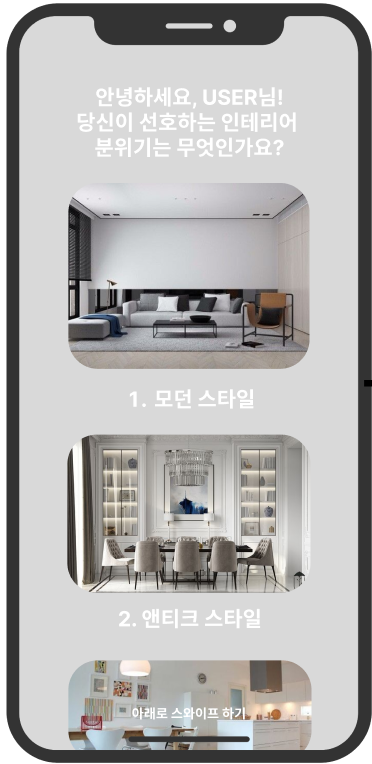
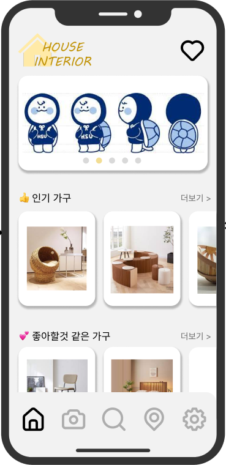
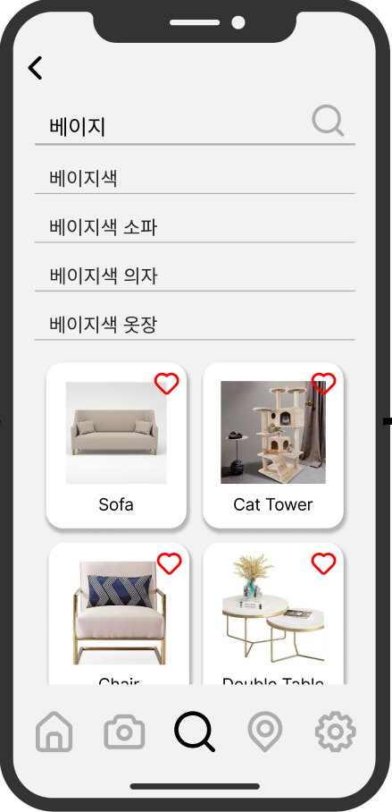
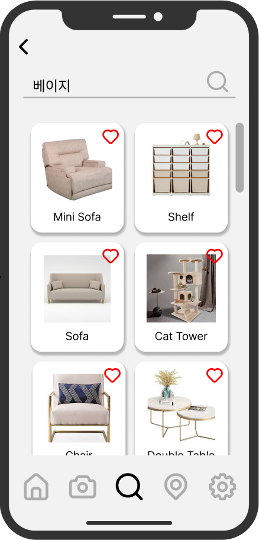
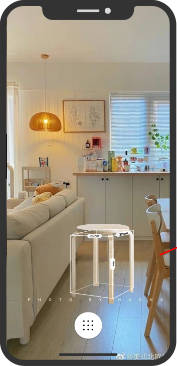
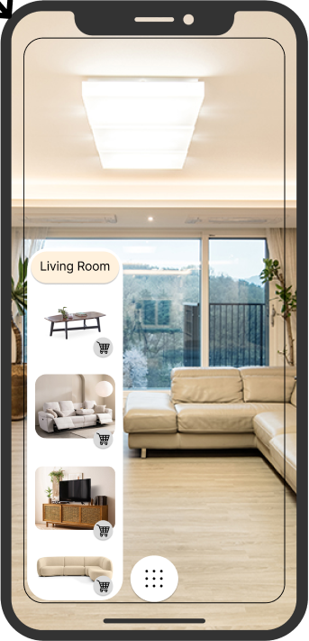
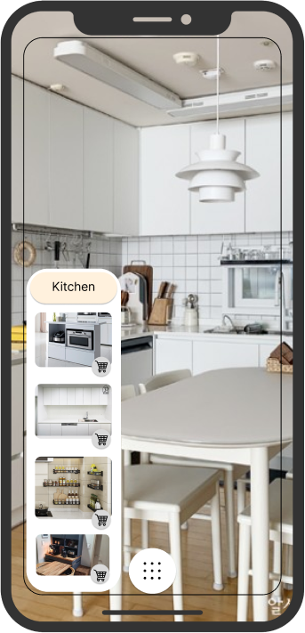
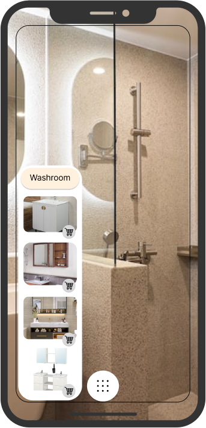

# 6. GUI 설계 흐름

### 6.1. 시작 : 사용자 선호도 조사

- 앱에 최초로 접속했을 때 나타나는 사용자 선호도 조사 화면입니다.
- 사용자가 처음 서비스를 접하게 되면 아직 데이터가 없기 때문에 기본적인 가구 인테리어 분위기에 대한 선호도를 조사하여 데이터를 수집합니다.
- 데이터 수집을 마치면 메인화면으로 넘어갑니다.

### 6.2. 메인

- 앱 시작시 메인이 되는 화면입니다.
- 이벤트 및 새로운 프로모션을 소개하는 캐러셀 슬라이더가 상단에 있습니다.
- 인기 가구에서는 최근 한달 간 판매량, 구매 누적 수, 관심도 등 인기도를 측정할 수 있는 적합한 기준에 따라 데이터를 정렬하여 선정된 가구들을 보여줍니다.
- 좋아할 것 같은 가구에서는 사용자 데이터를 분석하여 인테리어 가구를 추천합니다.
- 아래의 5가지 아이콘은 차례대로
    1. 메인화면
    2. AR 인테리어 배치 서비스 
    3. 검색 서비스 
    4. 위치 기반 인테리어 추천 서비스 
    5. 설정 메뉴

로 연결됩니다.

- 이 중 검색 서비스(5.3), AR 서비스 GUI(5.4)에 대해 아래에서 상세하게 설명합니다.

### 6.3. 검색

	
	
	

- 검색어를 아직 입력하지 않았을 때, 콘텐츠 기반 필터링 및 협업 필터링 방법으로 분석된 사용자 맞춤 데이터를 기반으로 사용자가 관심있어할만한 인테리어 가구들을 보여줍니다.
    - 콘텐츠 기반 필터링(Content-based Filtering) : 사용자가 소비한 아이템에 대해 아이템의 내용(content)이 비슷하거나 특별한 관계가 있는 다른 아이템을 추천하는 방법입니다.
    - 협업 필터링(collaborative filtering) : 많은 사용자들로부터 얻은 기호정보(taste information)에 따라 사용자들의 관심사들을 자동적으로 예측하게 해주는 방법입니다.
- 검색어를 입력하는 순간, solr 검색엔진에서 제공해주는 자동완성 단어들이 하단에 뜹니다.
- 검색어를 다 입력한 뒤 돋보기를 누르면, DB에 저장된 가구를 탐색하여 검색어와 연관된 가구들을 찾아 앱 화면에 보여줍니다.

### 6.4.1. AR - AR 인테리어 가구 배치

- 카메라가 켜지면서 사용자는 방을 실시간으로 촬영하게 됩니다.
- 아래의 메뉴를 클릭하면 검색창 및 3D 인테리어 가구 모형이 뜹니다.
- 사용자는 원하는 3D 인테리어 가구를 골라서 원하는 장소에 직접 배치시켜 볼 수 있습니다.
- AR 서비스는 사용자가 카메라로 비추는 공간을 측정하여 가구가 실제 크기와 같도록 조정하고, 조명 정보를 이용하여 가상 환경에서도 실제와 유사한 환경을 표현합니다.
- 가구의 실제 크기에 대한 정보(width, height, depth)가 나타납니다.

### 6.4.2. AR - 방 위치에 따른 인테리어 가구 추천

	
	
	

- 사용자가 카메라로 비추는 장소를 분석하여 거실, 주방, 화장실 등 어느 방인지 예측합니다.
    - CNN 알고리즘을 사용합니다.
    - 장소를 촬영하면 이미지, 데이터 셋으로 학습한 뒤 패턴을 찾습니다.
    - 이미지 분류가 완료되면 그에 따른 어울리는 가구를 추천합니다.
- 예측된 결과에 따라 왼쪽 하단 팝업에서 방에 어울리는 가구를 추천합니다.
    - 예를 들어, 분석 결과 주방일 경우 조리대, 식탁, 식기건조대 등을 추천합니다.