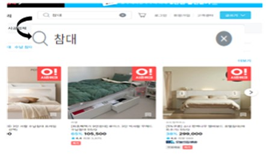
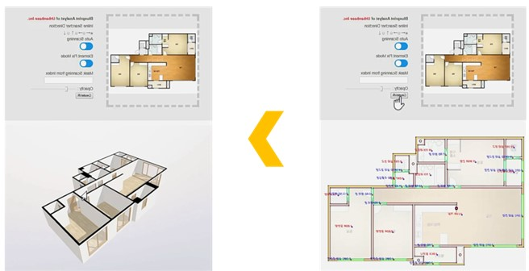
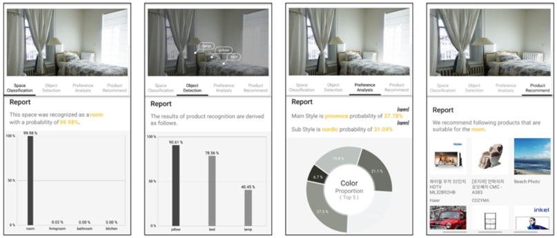
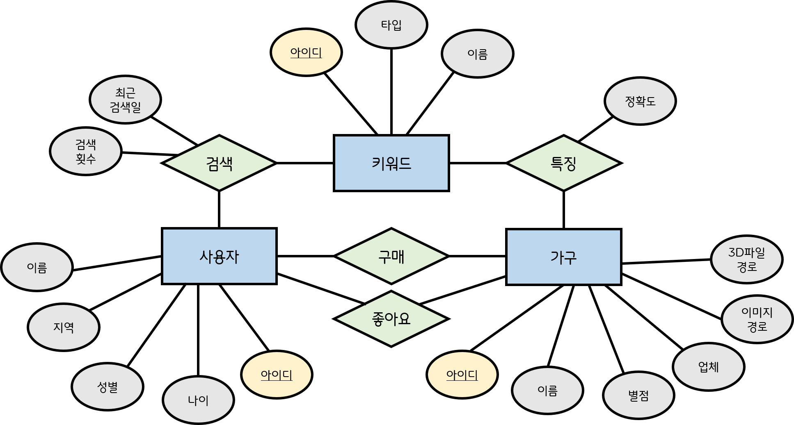
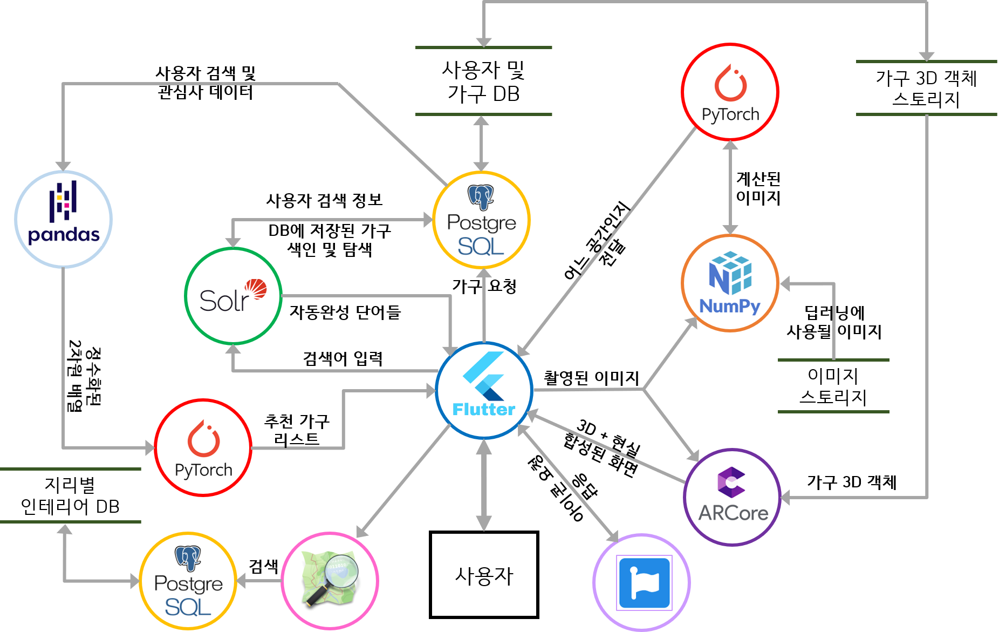
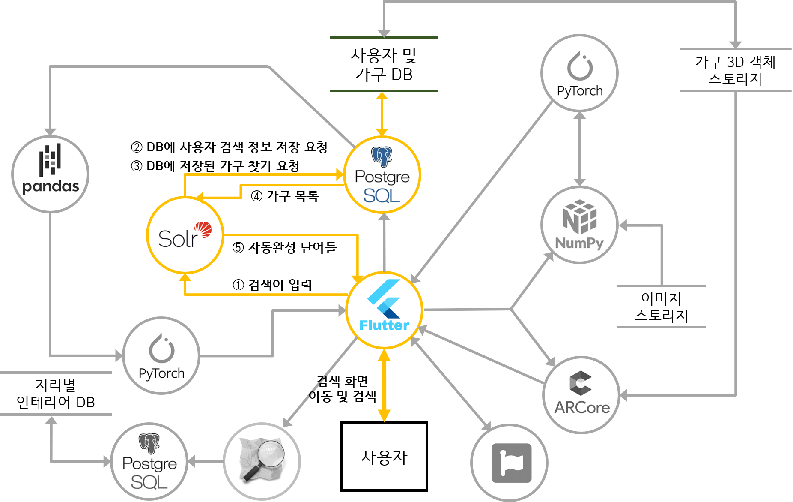
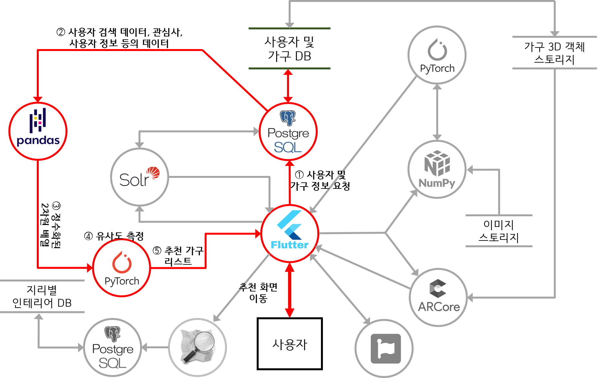
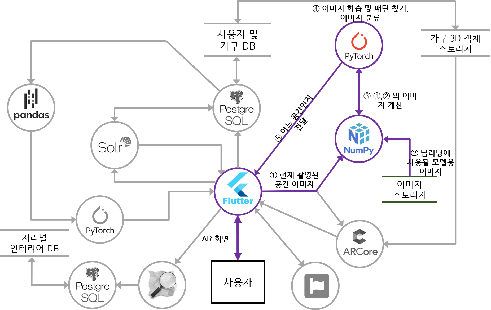
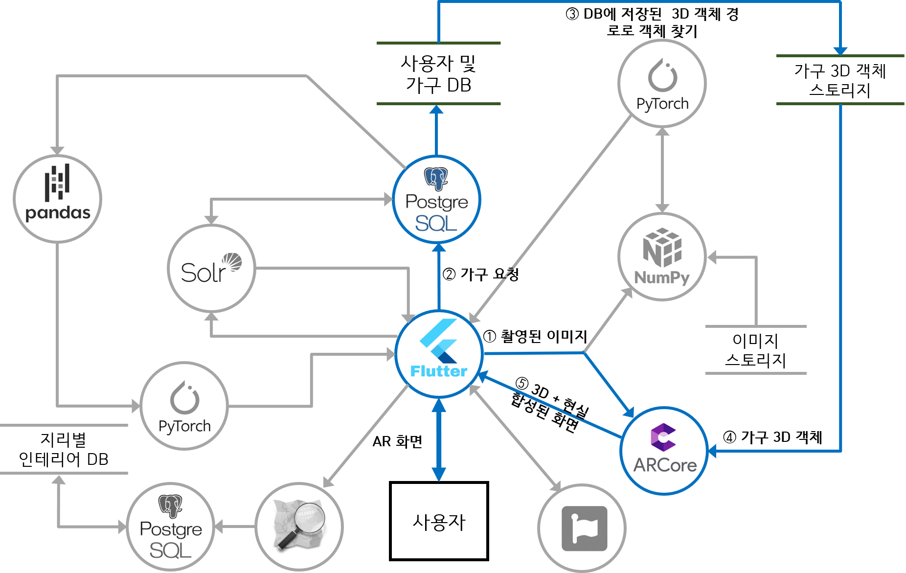
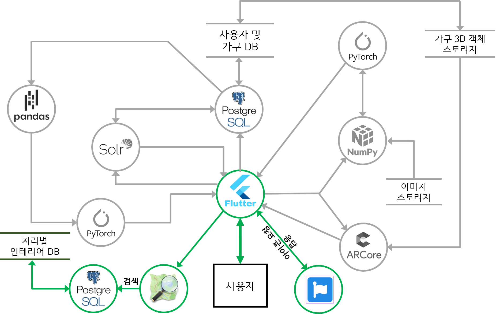

# 개인화 인테리어 서비스 플랫폼 제작

### 1. 서비스 소개

    1.1. 배경
    
    1.2. 기능 소개

### 2. 동향

    2.1. 과거와 현재 인테리어 서비스
    
    2.2. 미래 전망

### 3. 유사서비스 분석

    3.1. 오늘의 집
    
    3.2. 어벤베이스
    
    3.3. 차별점

### 4. ER다이어그램

    4.1. 데이터베이스
    
    4.2. 그 외 스토리지

### 5. DFD

    5.1. 검색어 저장 및 자동완성
    
    5.2. 사용자 추천
    
    5.3. 공간 분류
    
    5.4. 3D 모델링 객체 불러와서 인테리어 배치
    
    5.5. 사용자 위치 정보를 바탕으로 인근 사용자들의 인테리어 탐색
    
    5.6. UI 아이콘 제작

### 6. GUI 화면 흐름

    6.1. 시작: 사용자 선호도 조사
    
    6.2. 메인
    
    6.3. 검색
    
        6.4.1. AR - AR 인테리어 가구 배치
    
        6.4.2. AR - 방 위치에 따른 인테리어 가구 추천

### 7. 오픈소스 & 오픈소스 라이센스

    7.1	Flutter, PyTorch - BSD License

    7.2	Pandas, Numpy - BSD 3-Clause License

    7.3	AR core, Solr - Apache Lisence

    7.4	Font – awesome – SIL Open Font License

    7.5	PostgreSQL - PostgreSQL License

    7.6	OpenStreetMap - Open Database License(ODbL)

# 1.시스템 소개

### 1.1. 배경

2020년 사회적 거리 두기가 시행되었습니다. 사람들은 서로 간의 거리, 인원수, 이용 시간 등이 제한되었으며 마스크 착용, 실내 환기 등의 의무적인 일들이 생기게 되었습니다. 거리 두기는 외부 활동에 여러 불편함이 가져왔지만 거리 두기는 오랜 시간 지속되었고 이는 비대면과 비접촉 확산으로 이어지게 되었습니다. 사람들은 안전과 편안함, 제약으로 인해 외식보단 요리책과 배달음식을 찾게 되었고 대면 활동보다 비대면 수업과 재택근무를 하게 되었습니다. 사회 활동 제약과 비대면, 비접촉 확산은 사람들을 집에서 오랜 시간 머무르게 했습니다.

집에 머무르는 생활에 지친 사람들은 각종 취미 활동을 집에서 하기 시작하였습니다. 제한된 헬스장 대신에 집에서 홈트레이닝을 시작하였고 안전을 위해 매장에 방문하는 대신 온라인 쇼핑을 하였습니다. 이외에도 외부 활동 대신 집에서 할 수 있는 무언가를 찾기 시작했고 어쩔 수 없어 시작된 활동들은 사람들에게 간편함과 편의성을 보여주었습니다. 비대면 방식의 장점이 드러났고 이를 선호하는 사람들이 증가하자 자연스럽게 비대면적인 서비스들이 증가하게 되었습니다. 비대면 배송 시스템, 인터넷 플랫폼 기업, 간편결제 서비스 등의 개발과 발전으로 비대면은 사람들의 삶 속에 빠르게 정착했으며 되돌리기 어려운 변화를 가져왔습니다. 이후 사회적 거리 두기가 해제되었음에도 사람들은 비대면의 간편성과 편의성으로 배달음식, 온라인 쇼핑 등 비대면의 형태를 선호하고 있습니다.

집에서 머무르는 시간이 증가면서 자신의 공간을 꾸미고자 하는 사람들이 많아졌고 집이라는 공간이 휴식뿐만 아니라 재택근무, 여가 공간, 취미 활동 등 다양한 활동의 장소로 확장되면서
재택근무를 하는 직장인들은 업무 효율을 높이기 위해 주거공간에 자신만의 오피스로 꾸미는가 하면, 거실을 카페 분위기로 만들거나, 베란다를 캠핑장과 같은 컨셉으로 꾸며 휴식과 여가를 즐기고 있습니다. 이렇듯 효율적이고 자신에게 맞춤된 인테리어를 선호하는 사람들과 인테리어를 직접 하고자 하는 사람들이 증가하게 되었고 이는 곧 트렌드로 자리 잡게 되었습니다. 사람들은 어려운 인테리어를 도와줄 간단하고 편리한 서비스를 원하게 되었고 인테리어 시장 규모는 계속해서 증가하고 있는 추세입니다.

이러한 시대 환경과 트렌드에 맞춰 개개인의 취향에 맞춰주는 차별화된 인테리어 서비스를 구현해 보자고 생각하게 되었습니다.

### 1.2. 기능소개

저희가 구현한 인테리어 서비스의 기능으로는 다음과 같이 소개할 수 있습니다.

- 우선 AI를 이용한 가구 추천 기능 AR 서비스 이용 사용자에게 있는 가구를 AR로 스캔하여 3D 모형으로 모델링하고 이를 바탕으로 인테리어 해볼 수 있는 기능을 구현해보았습니다.
- 다음으로 사용자에게 없는 가구를 외부 DB에서 받아와서 AR로 띄우고 모델링하고 이를 바탕으로 인테리어 해볼 수 있는 기능을 통해 가구를 직접 옮기지 않아도 원하는 공간에 여러 각도로 배치해 볼 수 있게 구현해보았습니다.
- 추천 받은 인테리어의 구조와 사용자가 위치한 거주지의 구조가 일치하지 않아 생기는 문제를 해결하기 위해 사용자가 위치한 거실, 방에 따라 인테리어를 추천해 주는 기능을 구현하였습니다.
- 사용자 위치 기반 인테리어 추천 기능을 통해 손쉽게 여러 집의 도면과 인테리어를 추천 받아 사용자가 직접 방문해야 하는 수고를 덜 수 있습니다.
- 다음으로 저희는 콘텐츠 기반 필터링과 협업 필터링 전략을 혼합하여 사용한 사용자 맞춤 추천 서비스 기능을 구현하였습니다. 콘텐츠 기반 필터링은 사용자의 정보와 사용자가 검색한 데이터를 토대로 가구를 추천해 주는 전략입니다.
- 협업 필터링은 사용자와 비슷한 취향을 가진 다른 사용자가 선호했던 가구를 추천해 주어 사용자에게 새로운 가구에 흥미를 가질 수 있도록 도와주는 전략입니다.
- 다른 기능으론 가구를 직접 옮기는 수고를 덜어주고 없는 가구도 실제 환경에 배치해 볼 수 있는 AR 배치 기능, CNN 알고리즘을 사용하여 장소 촬영 시 패턴을 찾아 장소 유추하고 어울리는 가구를 추천해 주는 공간 예측 기능이 있습니다.

# 2. 동향 조사

### 2.1. 과거와 현재 인테리어 서비스

과거 인테리어 서비스는 매장에 직접 방문하여 디자인, 가격, 품질 등을 확인하고 구매하는 방식이 대부분이었습니다. 현재와 같은 3D, 또는 웹, 앱 서비스가 거의 존재하지 않았기 때문입니다.
혹은 인테리어 업체에 맡기는 경우도 있었지만 비용이 많이 든다는 인식이 있었고 소비자가 원하는 디자인과 소비자에게 설명을 듣고 작업한 인테리어 업체의 디자인이 일치하지 않아 문제가 발생하기도 했습니다. 소비자 문화와 인테리어의 인식이 지금과는 달랐기에 대부분의 사람들이 집 인테리어에 큰 신경을 쓰지 않았습니다. 인테리어를 신경 쓰는 얼마 안 되는 사람들 또한 집을 어떻게 꾸밀지 모르는 소비자가 대부분이었고 적은 비용으로 자신의 공간을 자신이 좋아하는 디자인의 공간으로 꾸밀 수 있다는 것을 모르는 사람들이 대부분이었습니다.

현대에 들어서 인테리어 서비스는 빅데이터, 인공지능, AR 등 다양한 기술들을 적용해 여러 서비스를 제공하고 있습니다. 오랜 사회적 거리 두기로 인한 비대면 수업, 재택근무자 등이 증가함에 따라 사람들이 집에 머무는 시간과 인테리어에 대한 관심, 맞춤형 인테리어와 직접 인테리어를 원하는 사람의 증가하게 되었고 이는 인테리어 산업은 기존과 다른 방향으로 성장하였습니다. 직접 방문보다 웹과 앱 등을 이용해 여러 디자인과 다양한 제품들을 추천해 주거나 시공 방법을 알려주는 서비스가 생겼고 인테리어 업체 관련해서는 업체와 소비자를 원활하게 이어주고 서비스들도 생겼습니다. 또한 3D 기술, AI 기술 등을 이용한 인테리어 시뮬레이션 서비스가 생겨 소비자가 원하는 디자인을 보다 직관적으로 느낄 수 있게 되었습니다. 이렇듯 집을 더 이상 꾸미는 것에서 그치는 것이 아닌 효율과 개개인 맞춤을 중시하는 트렌드에 맞춰 인테리어 서비스는 보다 다양하고 실용적인 가구 디자인과 효율적인 공간을 추천하고 간편하고 편리하게 이용할 수 있는 서비스를 제공하고 있습니다.

### 2.2. 미래 전망

최근 들어 모바일 쇼핑의 비중이 크게 늘고 있는 만큼, 인테리어 서비스는 간편하게 옷을 쇼핑하는 것처럼 가구 또한 간편하게 쇼핑할 수 있게 되어 사람들의 가구 인테리어에 대한 인식이 전과 달리 가볍고 대중화되었습니다.

또한 ar, ai 기술을 통해 사용자가 직접 다양한 스타일로 공간을 꾸며볼 수 있기 때문에 인테리어를 함에 있어서 재미와 영감을 얻을 수 있는 기대효과를 지니고 있습니다. 이러한 ar, ai 기술을 도입한 인테리어 서비스의 장점들은 고객 확보를 하는 데 있어서 확실한 기대효과를 불러일으키기에 충분한 결과들을 가지고 오고 있습니다.

최근 KT 에스테이트에선 빅데이터, ar, ai 등의 첨단 기술력을 바탕으로 맞춤형 온라인 인테리어 서비스를 개발하겠다는 구상을 밝히듯이 여러 곳에서 인테리어 서비스에 주목하고 있습니다.

- 구체적인 예시로 한샘에선 주거유형, 평형대, 예산, 색상 등 조건에 맞는 인테리어 완성품을 제공하는 디지털 기술을 접목하여 수요자가 현관, 거실, 침실, 주방 등을 자유롭게 오가며 개별 제품의 가격 및 소재 등 정보 확인을 가능케 하는 미래기술을 시도하는 모습을 보였습니다.
- 또한 리뉴얼한 홈씨씨 인테리어 분당 판교점에서는 욕실과 주방 등 실제 아파트를 옮겨다 놓은 듯한 다양한 스타일의 토털 인테리어 쇼룸과 최신 인테리어 자재를 만나볼 수 있는 자재 전시존, 창호 전시존을 마련하며 발전하는 인테리어 서비스의 모습을 보여주었습니다.

이와 같이 여러 회사에서 인테리어 서비스에 미래지향적 기술들을 더하는 모습들을 볼 수 있습니다.

# 3. 유사서비스 분석

 유사 서비스로는 대표적으로 오늘의 집과 어반 베이스가 존재합니다.

### 3.1. 오늘의 집

 콘텐츠 탐색과 쇼핑이 가능한 플랫폼(Shoppable Content Discovery Platform)'으로 쇼핑몰과 3D 인테리어 구현할 수 있는 기능을 서비스하고 있습니다. 대표적인 기능은 다음과 같습니다.

- RMP

 몰로코라는 회사의 딥러닝 기술 기반의 기술인 RMP를 도입한 것입니다. 이는 머신러닝 기술을 기반으로 연관도 낮은 광고가 유저 가치를 저해하는 것을 방지하고 지속해서 유입되는 신규 셀러에게도 광고를 통한 성장 기회를 제공할 수 있습니다. 즉, 연관도가 높은 광고로 소비자들과 광고주들의 환심을 살 수 있습니다.

- 서제스트

 머신러닝 AI를 활용해 검색과 추천을 융합한, 이른바 세저스트(Seargest : search + suggest)에 초점을 맞춰 검색 기술을 내재화해 나간다는 전략입니다. 즉, 실수로 잘못 입력한 검색어도 알아서 수정되고 정확한 검색어가 생각나지 않아 대충 비슷한 단어를 쳐도 원하는 결과를 구현할 수 있는 검색 환경을 구현한다는 것입니다.

- 3D 인테리어(Bate)

 아키드로우 회사와 협업한 서비스이다. 인테리어 가구 배치와 2D 도면에서 3D를 구현하는 기능도 존재하지만, 아직 베타 서비스로 앞에 언급할 어반 베이스보다 비교적 낮은 퀄리티로 운영 중입니다.

### 3.2. 어반 베이스

 2D 도면을 단 몇 초 만에 직관성 높은 3차원 공간으로 변환시키는 ‘오토 스케치’ 기술을 기반으로 일반인 대상의 올인원 인테리어 플랫폼 ‘어반베이스’와 기업 고객 대상의 서비스형소프트웨어(SaaS) 형태의 B2B(기업 대 기업) 서비스를 제공합니다. 대표적인 기능으로는 다음과 같습니다.

- 오토 스케치

  인공지능의 머신러닝 기능을 바탕으로 미리 입력된 건축법규와 다량의 도면 정보를 바탕으로 기계 학습하면 3초 만에 2D에서 3D 변환이 가능한 기술입니다.

 기존에는 벡터값이 존재하는 캐드 (CAD) 파일을 3D로 만들어주는 특허만 있었다면, 어반베이스의 특허는 JPG, PNG 등 벡터값이 없는 이미지 기반의 도면 파일을 프로그램이 미리 학습된 건축법규와 건축 도면 정보에 따라 3D로 복원해내는 차별화된 기술이라고 할 수 있습니다.

- AR 뷰어

 자체 증강현실 구축 서비스로, 구글의 AR 코어(AR Core), 애플의 AR키트(AR Kit) 같은 기존 증강현실 플랫폼에서 제공하지 않는 사용자 경험 측면을 강화한 것이 특징입니다. AR Viewer 기술을 활용하면 3D 콘텐츠 배치뿐만 아니라 이동, 회전, 사이즈 확대 및 축소, 제거 등의 조작 기능과 세션 관리, 화면 캡처, 공유 등의 편리 기능을 추가할 수 있습니다.

- Space AI

 인공지능을 이용한 공간 분석 기술 (API)로 컴퓨터 비전 (Computer Vision)과 딥러닝 (Deep Learning)을 이용하여 실내 공간의 스냅샷을 분석을 분석합니다. 기능으로는 크게 4가지가 존재하는데 다음과 같습니다.

① 공간 분류 (Space Classification)

공간 이미지를 분석하여 공간을 거실 · 방 · 주방 · 욕실 중 하나의 공간으로 분류해주는 기능해주는 기능입니다.

② 사물 검출 (Object Detection)

 공간 내에 있는 가구, 전자제품, 인테리어 소품 등의 종류 및 위치를 검출하는 과정으로 기술은 Faster-RCNN에 기반합니다.

③ 취향 분석 (Preference Analysis)

 공간의 인테리어 스타일을 7가지 (클래식/모던/내추럴/북유럽/로맨틱/빈티지/캐주얼)로 분류하고 나아가 고객의 사회관계망 서비스(SNS)계정을 활용하여 고객의 취향을 분석합니다.

④ 제품 추천 (Product Recommendation)

 공간 분류, 사물 검출, 취향 분석의 결과를 바탕으로 개인에게 어울리는 제품을 추천해주는 기능을 개발 중입니다.

 이는 공간에 위치한 다양한 사물들을 검출하고, 검출된 사물들을 바탕으로 어반베이스의 자체 알고리즘을 적용하여 이미지를 거실/방/주방/욕실 등의 공간 중 하나로 분류할 수 입니다. 또 공간 분류와 사물 검출 정보를 통해 공간의 인테리어 스타일을 분석해 주고, 공간에 어울리는 제품을 추천하는 데 활용할 수 있습니다.

- 3D뷰어

 3D객체들을 추가 개발없이 손쉽게 렌더링할 수 있는 기술로 Web, HMD, iOS/Android 등 다양한 디바이스에 대응이 가능한 SDK를 제공한다. 또 SaaS(서비스형 소프트웨어)형으로 접근성은 높이고 인터페이스는 최대한 간편하게 설계해 조작을 용이하게 했다. 그리하여 웹상에서 가상 인테리어를 즐길 수 있는 어반베이스의 ‘3D 인테리어’의 특장점은 살리되, 최대 8K 초고화질 360도 투어로 몰입감을 높여 모델하우스나 오프라인 쇼룸에 방문한 것 같은 느낌을 줍니다.

- 라이브 스케치

 누구나 쉽게 사용할 수 있는 3D 모델링 기술입니다. 사용자가 웹상에서 직접 2D 도면을 직접 그리고 이를 실시간으로 3D로 변환해서 보여주는 서비스입니다.

- 3D홈디자인

 바탕에는 도면 자동 변환 기술인 오토 스케치 (Auto Sketch)와 3D 렌더링 기술인 3D 뷰어 (3D Viewer)가 존재한다. 2D 도면 이미지를 3차원 공간으로 자동 변환해주는 자체 기술 - 오토 스케치를 활용하여 대량의 3D 공간 데이터를 확보하고 있으며 3D 뷰어 기술을 통해 해당 공간 데이터를 고해상도로 경험할 수 있도록 해줍니다.

### 3.3. 차별점

 오늘의 집은 자사가 3D 인테리어 기술을 보유하고 있지 않기 때문에 주력 서비스가 아닙니다. 따라서 앞서 언급했듯 어반 베이스보다 기술력이 떨어진다고 생각합니다. 오히려 주력 서비스로는 인테리어 관련 쇼핑몰과 여러 인테리어를 커뮤니티화하여 고객층을 유치하는 것으로 보입니다. 반면 어반 베이스는 3D 인테리어 구현을 중점으로 둔 서비스를 구축하고 있기 때문에 이 부분에 있어 다양한 서비스를 제공하고 있지만, 그에 비해 실제 팔고 있는 다양한 가구들과 인테리어 요소를 취향껏 골라 배치하는 쇼핑몰 적인 부분이 비교적 떨어졌습니다.

따라서 오늘의 집의 쇼핑몰 적인 부분 즉, 실제 팔고 있는 가구들의 취향을 분석해 추천해주는 기능이나 검색어 관련된 부분과 더불어 어반베이스의 기술적인 부분 특히 가구를 AR 환경에 배치하는 부분 등을 합쳐 서비스하는 플랫폼을 구현할 예정입니다. 또 Maxst와 협업해 사용자가 가지고 있는 가구를 3D 객체로 구현하여 AR 환경에서 배치할 수 있도록 기능을 넣어 기존의 서비스들과 차별화를 둘 예정입니다.

# 4. 데이터 구조

### 4.1. 데이터베이스

- 사용자 및 가구 데이터베이스 - 사용자 및 가구의 정보를 저장하기 위한 데이터베이스로 가구의 상세 정보만 표시하는것 뿐만 아니라 사용자 추천에도 필요한 정보를 제공합니다.
  
    ERD
    
    
    - 사용자 테이블
        - 사용자의 기본 정보가 담긴 테이블로 나이, 성별, 지역 등의 정보가 저장됩니다.
    - 키워드 테이블
        - 가구에 대한 키워드 정보를 저장한 테이블입니다.
        - 타입 : 이 키워드가 무엇을 나타내는 것인지 저장하는 컬럼으로 재질, 색상, 장소, 분류 등이 있습니다.
        - 이름 : 타입에 맞는 특성을 저장하는 컬럼으로 예를들어 유리, 베이지, 욕실, 침대 등이 있습니다.
    - 가구 테이블
        - 가구의 기본 정보가 담긴 테이블로 이름, 사용자 평점, 업체, 이미지 경로, 3D 파일 경로 등이 저장됩니다.
        - 이미지 및 3D파일은 스토리지의 경로를 참조하여 사용합니다.
    - 검색 테이블
        - 사용자가 키워드를 검색한다는 의미에서 생겨난 관계집합으로 다대다 관계입니다.
        - 사용자가 특정 키워드에 대한 검색한 정보를 저장하는 테이블로 최근 검색일과 검색 횟수가 저장됩니다.
        - 사용자 추천 데이터로 제공됩니다.
    - 특징 테이블
        - 가구가 특정 키워드에 해당하는 특징을 가진다는 의미에서 생겨난 관계집합으로 다대다 관계입니다.
        - 하나의 가구는 여러개의 특징을 가집니다 : 베이지색 목재 침대, 검정색 가죽 소파 등
        - 정확도 : 해당 키워드가 가구에게 얼마나 적합한지 나타내는 컬럼입니다.
    - 구매 및 좋아요 테이블
        - 사용자가 구매했거나 좋아요한 가구의 관계가 저장됩니다.
- 지리별 인테리어 데이터베이스 - 사용자의 위치와 지리별 인테리어를 저장하기 위한 데이터베이스로 사용자 위치를 기반으로 하여 해당 위치의 인근 인테리어 정보들을 제공합니다.

### 4.2. 그 외 스토리지

- 이미지 스토리지 : 가구의 사진 및 공간 분류를 위한 딥러닝에 사용될 모델학습용 이미지가 저장됩니다.
- 3D 오브젝트 스토리지 : AR에서 사용할 가구의 3D 모델링 객체가 저장됩니다.

# 5. DFD 흐름 및 구조

### 전체 흐름

### 5.1. 검색어 저장 및 자동완성

- 기능 활용도
    - 사용자가 검색을 할 때 자동완성 및 오타교정 등의 기능을 제공해 편의성이 증가합니다.
    - 사용자가 검색만으로도 관심이 있다는 것으로 생각해 사용자 추천에 활용이 될 계획입니다.
- 진행 Flow
    - 사용자가 검색을 하면 검색한 단어 및 키워드를 데이터베이스에 저장하고 사용자가 검색한 단어에 관련된 가구를 데이터베이스에서 찾습니다.
    - Solr가 데이터베이스에서 받은 가구 목록을 토대로 자동완성 및 오타교정이 된 단어 리스트를 Flutter를 통해 사용자에게 보여줍니다.

### 5.2. 사용자 추천

- 기능 활용도
    - 사용자의 취향에 맞는 가구가 무엇이 있는지 어떤 가구를 좋아할 것 같은지 예상해서 가구 리스트를 보여줌으로써 가구의 판매를 촉진시킵니다.
    - 직접 찾아볼 필요 없이 사용자 취향의 가구를 한 화면에 소개시켜 주기 때문에 사용자의 편의성도 증가합니다.
- 진행 Flow
    - 사용자 추천에 사용될 데이터를 데이터베이스로 부터 얻습니다.
    - 사용될 데이터
        - 가구 정보 (유사도 측정 대상)
        - 컨텐츠 기반 필터링
            - 사용자의 성별, 나이 등의 사용자 정보
            - 사용자가 좋아요 표시를 한 가구들의 정보
            - 사용자가 최근에 검색했거나 자주 검색한 가구 혹은 단어(목재, 블랙, 거실 등)의 정보
        - 협업 필터링
            - 다른 사용자의 정보 및 다른 사용자 취향의 가구들의 정보
    - 이 데이터베이스의 데이터들을 Pandas를 통해 읽어들이고 2차원 배열로 저장하고 배열의 데이터들을 모두 정수 형태로 변환합니다.
    - PyTorch에서 데이터베이스의 정보가 담긴 2차원 배열을 이용하여 유사도가 높은 가구 여러개를 추출하여 Flutter를 통해 사용자에게 보여줍니다.

### 5.3. 공간 분류

- 기능 활용도
    - 현재 공간을 촬영해 어떤 공간인지 분석하고 어울리는 가구 리스트를 제공해줘서 가구를 찾아볼 필요 없이 AR을 이용하여 배치할 수 있습니다.
- 진행 Flow
    - 사용자가 현재 공간을 촬영합니다.
    - 현재 촬영된 공간의 이미지와 이미지 스토리지에 저장된 딥러닝에 사용될 모델 학습용 이미지가 Numpy를 이용해 계산됩니다.
    - PyTorch에서 CNN 알고리즘을 사용하여 모델용 이미지들로 학습하고 패턴을 찾아 현재 촬영된 이미지가 어떤 공간을 촬영한 것인지 분류됩니다.
    - 현재 공간이 어떤 공간인지 Flutter에게 전달합니다. 추후 AR에서 사용됩니다.

### 5.4. 3D 모델링 객체 불러와서 인테리어 배치

ARCore, MAXST

- 기능 활용도
    - 사용자가 필요한 가구를 구매하려고 할 때 그 크기가 가격으로 인한 부담 때문에 구매 여보에 대한 확신이 들지 않을 때, 혹은 인터리어 적으로 어울릴지에 대한 확신이 들지 않을 때나 집 안에 장소 구조를 고려하여 배치 하는게 부담이 될 때 해당 기능이 도움이 될 것이라 예상됩니다.
- 선정 이유
    - AR 오픈소스 중 많이 알려진 오픈소스이고 Android뿐만 아니라 ios도 지원하기 때문에 선정하게 되었습니다.
- 진행 Flow1
    - 사용자가 관심을 가지고 있는 가구 혹은 PyTorch에서 제시한 장소에 따른 추천 가구 등을 “사용자 및 가구 DB”에 저장합니다.
    - 가구 정보가 들어있는 database를 토대로 해당 가구들을 3D 모델링화 시켜서 “가구 3D 객체 스토리지”에 저장합니다.
    - 저장되어있는 3D 객체 가구를 불러와서 ARCore를 통해 사용자가 원하는 위치에 배치해보면서 인테리어 시뮬레이션을 진행합니다.
        - ARCore는 모션추적, 환경인식, 조명추정의 3가지 주요 기능을 사용하여 스마트폰의 카메라를 통해 가상 현 실을 실제 세계와 통합하여 AR을 구현합니다.
- 진행 Flow2
    - 사용자가 가구를 배치하려고 휴대폰으로 공간을 촬영하기 시작합니다.
    - 배치하고자하는 가구를 저장되어있는 3D 객체 가구에서 불러와서 ARCore를 통해 사용자가 원하는 위치에 배치해보면서 인테리어 시뮬레이션을 진행합니다.

- 추가 기능
    - 해당 기능은 오픈소스를 이용해서 구현 할 기능이 아니기 때문에 별도의 기능으로 빼서 추가로 넣었습니다.
    - 오늘의 집에서 어토스케치 업체와 협업하여 3D인테리어 기능을 제공해주는 방식과 마찬가지로 MAXST에서 제공하고 있는 여러 증강현실 기능 중 현실에 있는 물체를 즉시 3D모델링 시켜서 증강현실 속 물체로 반영시켜주는 기능을 활용하여 제공해주고자 합니다.
    - 기능 활용도
        - 사용자가 가지고 있는 가구를 재배치하고자 할 때 가구 배치에 대한 고민을 덜어줄 수 있는 부분에서 해당 기능이 유용하게 쓰일거라 예상합니다.
    - 진행 Flow
        - 사용자가 가지고 있는 가구를 휴대폰으로 촬영하기 시작합니다.
        - 촬영되고 있는 이미지 객체를 MAXST에서 제공해주는 기능을 활용하여 즉시 가구 3D 모델링 제작을 시작합니다.
        - 모델링 된 가구를 현실과 합성하여 가구 재배치할 수 있습니다.

### 5.5. 사용자 위치 정보를 바탕으로 인근 사용자들의 인테리어 탐색

OSM

- 기능 활용도
    - 사용자 위치 정보를 바탕으로 인근에 거주중인 다른 사용자들의 인테리어를 참고하고자 할 때 혹은 비슷한 집 구조에서의 인테리어를 참고하고자 할 때 유용하게 쓰일것이라 예상합니다.
    - 지도 내 실내 인테리어를 직접 띄워주는 것이 아닌 인근에 비슷한 집 구조를 가진 인테리어가 어느정도 있는지, 사용자는 어느정도 있는지를 파악하고 지도에 해당 인테리어를 볼 수 있도록 이동할 수 있는 url정보를 아이콘 형태로 띄우는 정도로 해당 오픈소스를 활용할 예정입니다.

- 선정 이유
    - 상용화된 구글이나 카카오 API 등 더 좋은 기능을 제공할 수 있는 구현 방법이 있지만 오픈 소스만을 이용하여 해당 프로젝트를 완성시키고자 하였습니다.
    - 저장한 database를 바탕으로 누구나 자유롭게 편집 가능한 무료배포 서비스인 OSM이 본 프로젝트 서비스와 어울린다고 판단하였습니다.
    - 다양한 OpenGL 3D Graphics Library 와 결합이 가능해서 3D 지도 제작 기능을 쉽게 넣을 수 있습니다.
- 진행 Flow1
    - 지리별로 인테리어 정보들을 database에 저장합니다.
    - 사용자가 본인이 관심있는 지역의 인근 인테리어 정보들을 알아보고자 OSM에 접속하여 검색을 요청합니다.
    - OSM에서 사용자의 검색으로 들어온 지역의 인근 인테리어 정보를 “지리별 인테리어 DB”에서 탐색하여 응답을 보냅니다.

### 5.6. UI 아이콘 제작

Font-Awesome

- 기능 활용도
    - 사용자가 보기 쉽게 프론트 UI 작업에 필요한 아이콘을 다체롭게 제공하는데 쓰일 예정입니다.

- 선정 이유
    - 웹에서 아이콘이 필요할 때 가장 많이 사용되는 라이브러리이고 Solid, Regular, Light 등 하나의 아이콘에 다양한 변형 버전 제공 및 사이즈 변경이 가능하기 때문에 원하는데로 수정이 가능합니다.

# 6. GUI 설계 흐름

### 6.1. 시작 : 사용자 선호도 조사

- 앱에 최초로 접속했을 때 나타나는 사용자 선호도 조사 화면입니다.
- 사용자가 처음 서비스를 접하게 되면 아직 데이터가 없기 때문에 기본적인 가구 인테리어 분위기에 대한 선호도를 조사하여 데이터를 수집합니다.
- 데이터 수집을 마치면 메인화면으로 넘어갑니다.

### 6.2. 메인

- 앱 시작시 메인이 되는 화면입니다.
- 이벤트 및 새로운 프로모션을 소개하는 캐러셀 슬라이더가 상단에 있습니다.
- 인기 가구에서는 최근 한달 간 판매량, 구매 누적 수, 관심도 등 인기도를 측정할 수 있는 적합한 기준에 따라 데이터를 정렬하여 선정된 가구들을 보여줍니다.
- 좋아할 것 같은 가구에서는 사용자 데이터를 분석하여 인테리어 가구를 추천합니다.
- 아래의 5가지 아이콘은 차례대로
    1. 메인화면
    2. AR 인테리어 배치 서비스
    3. 검색 서비스
    4. 위치 기반 인테리어 추천 서비스
    5. 설정 메뉴

로 연결됩니다.

- 이 중 검색 서비스(5.3), AR 서비스 GUI(5.4)에 대해 아래에서 상세하게 설명합니다.

### 6.3. 검색

   
   
   

- 검색어를 아직 입력하지 않았을 때, 콘텐츠 기반 필터링 및 협업 필터링 방법으로 분석된 사용자 맞춤 데이터를 기반으로 사용자가 관심있어할만한 인테리어 가구들을 보여줍니다.
    - 콘텐츠 기반 필터링(Content-based Filtering) : 사용자가 소비한 아이템에 대해 아이템의 내용(content)이 비슷하거나 특별한 관계가 있는 다른 아이템을 추천하는 방법입니다.
    - 협업 필터링(collaborative filtering) : 많은 사용자들로부터 얻은 기호정보(taste information)에 따라 사용자들의 관심사들을 자동적으로 예측하게 해주는 방법입니다.
- 검색어를 입력하는 순간, solr 검색엔진에서 제공해주는 자동완성 단어들이 하단에 뜹니다.
- 검색어를 다 입력한 뒤 돋보기를 누르면, DB에 저장된 가구를 탐색하여 검색어와 연관된 가구들을 찾아 앱 화면에 보여줍니다.

### 6.4.1. AR - AR 인테리어 가구 배치

- 카메라가 켜지면서 사용자는 방을 실시간으로 촬영하게 됩니다.
- 아래의 메뉴를 클릭하면 검색창 및 3D 인테리어 가구 모형이 뜹니다.
- 사용자는 원하는 3D 인테리어 가구를 골라서 원하는 장소에 직접 배치시켜 볼 수 있습니다.
- AR 서비스는 사용자가 카메라로 비추는 공간을 측정하여 가구가 실제 크기와 같도록 조정하고, 조명 정보를 이용하여 가상 환경에서도 실제와 유사한 환경을 표현합니다.
- 가구의 실제 크기에 대한 정보(width, height, depth)가 나타납니다.

### 6.4.2. AR - 방 위치에 따른 인테리어 가구 추천

   
   
   

- 사용자가 카메라로 비추는 장소를 분석하여 거실, 주방, 화장실 등 어느 방인지 예측합니다.
    - CNN 알고리즘을 사용합니다.
    - 장소를 촬영하면 이미지, 데이터 셋으로 학습한 뒤 패턴을 찾습니다.
    - 이미지 분류가 완료되면 그에 따른 어울리는 가구를 추천합니다.
- 예측된 결과에 따라 왼쪽 하단 팝업에서 방에 어울리는 가구를 추천합니다.
    - 예를 들어, 분석 결과 주방일 경우 조리대, 식탁, 식기건조대 등을 추천합니다.

# 7. 오픈소스 & 오픈소스 라이선스

### 7.1 Flutter, PyTorch - BSD License
**Flutter**

- 오픈소스 소개 및 특징
    - Google에서 출시된 모바일/웹/데스크톱 크로스 플랫폼 GUI SDK로, Dart언어를 사용하며 하나의 코드 베이스로 안드로이드, 리눅스, Windows, macOS, iOS 및 웹브라우저에서 모두 동작 되는 앱을 위해 출시했습니다.
    - 플랫폼에 관계없이 Flutter용 테마 디자인 라이브러리 적용이나 테마 커스텀 가능하며 보안이 취약한 기존 JS 웹 앱 방식을 대체한 웹 어셈블리 모드로 한 임베드 웹 앱 영역에 사용하기에 좋습니다.
    - 소스코드를 네이티브로 직접 컴파일하며 UI 자체 렌더링 엔진으로 직접 렌더링하여 위젯이 빠르고 자연스럽게 잘 동작하며 커스터마이징과 확장이 쉽기 때문에 좋은 성능을 가지고 있습니다.

**PyTorch**

- 오픈소스 소개 및 특징
    - 이미지 및 영상 데이터 처리를 개발하기 위한 여러 API 들 존재하며, 디버깅이 쉽고 직관적이고 간결한 코드가 특징입니다.
    - 연산 정의와 값 초기화가 동시에 이루어져서 Define by Run 방식을 기반으로 한 실시간 결과값을 시각화합니다.
    - 학습 및 추론 속도가 매우 빠르며 다루기 쉽고, Numpy 같은 파이썬 라이브러리와 높은 호환성을 가집니다.
    - GPU 로도 연산이 가능합니다.
    - 모델 그래프를 만들 때 정적인 상태가 아니므로 언제든지 데이터에 따라 조절이 가능합니다.

**BSD License**

- 특징 및 제약조건
    - BSD계열 소프트웨어에 적용되는 라이선스. 소스코드를 공개하지 않아도 되는 대표적인 오픈소스 SW 라이선스 중 하나입니다.
    - SW에 대한 대가를 미국 국민의 세금으로 미리 지불했기 때문에 사람들에게 사용할 수 있는 범위가 넓어졌습니다.
    - SW를 배포하는 경우 저작권 표시, 보증책임이 없다는 내용을 표시해야 합니다.
    - BSD 라이선스에 따른 프로그램을 바이너리 형태로 재배포하는 경우에는 소스코드를 배포하는 경우와 마찬가지로 배포판과 함께 제공되는 문서에 면책조항을 담아야 합니다.
    - BSD 라이선스의 경우 의무사항만 준수한다면 소스코드를 공개하지 않아도 됩니다.

### 7.2 Pandas, Numpy - BSD 3-Clause License
**Pandas**

- 오픈소스 소개 및 특징
    - 2 차원 배열 형태를 가지며 서로 다른 여러 데이터타입을 담을 수 있는 Dataframe 이라는 효과적인 자료구조를 제공하여 관계형 DB 분석에 적합합니다.
    - 데이터의 가독성을 높이고 데이터 분석에 필요한 명령과 기능 제공합니다.
    - 잘못 정렬된 데이터에 의한 오류 방지 및 다양한 방식으로 색인된 데이터 다룰 수 있습니다.
    - 시계열 데이터와 비시계열 데이터를 함께 다룰 수 있는 통합 자료 구조입니다.
    - SQL 테이블 또는 CSV 파일과 같은 테이블 형태의 데이터를 읽을 수 있고 일반 DB 처럼 데이터를 합치고 관계연산을 수행하는 기능을 가지고 있습니다.
    - 데이터의 통계 및 시각화의 기능 및 누락된 데이터의 유연한 처리가 가능합니다.

**Numpy**

- 오픈소스 소개 및 특징
    - 선형대수 계산식을 구현하는데 도움을 주는 오픈소스 Python 패키지입니다.
    - 컴퓨터가 이미지 데이터를 위해서 숫자 형식의 배열이 필요한데, 배열의 데이터가 커질수록 저장 및 가공의 효율성을 보장해줍니다.
    - 선형대수 함수가 내장되있어 빠르고 효율적인 이미지 계산이 가능합니다.
    - Python 의 리스트보다 적은 메모리를 사용하며 계산 속도는 훨씬 빠르고, 반복문 없이 데이터 배열에 대한 처리를 지원해줍니다.

**BSD 3-Cluase License**

- 특징 및 제약조건
    - “BSD-new”로 불리기도 합니다.  
    - 사전 서면 승인없이는 저자의 이름이나 기여자들의 이름을 BSD SW로부터 파생된 제품을 보증하거나 홍보할 목적으로 사용해서는 안 된다는 항목이 3-Clause이상 라이선스에 추가됩니다.
    - 재배포시 저작권 표시, 준수 조건 및 보증부인에 대한 고지사항을 소스코드 또는 문서 및 기타 자료에 포함해야 합니다.

### 7.3 AR core, Solr - Apache Lisence
**AR core**

- 오픈소스 소개 및 특징
    - 구글에서 개발한 Android의 AR 소프트웨어 개발 키트(SDK)입니다.
        - Android 뿐만 아니라 Unity(for Android, iOS), Unreal, Web, iOS 에서 SDK를 지원합니다.
        - Java /OpenGL, Unity, Unreal 에서 주로 작동합니다.
    - 모션추적, 환경인식, 조명추정의 3가지 주요 기능을 사용하여 스마트폰의 카메라를 통해 가상현실을 실제 세계와 통합하여 AR을 구현합니다.
        - 모션추적
            - 휴대폰의 카메라를 사용하여 실내의 특징 점을 추출하고, 추출된 특징점을 이용해서 사물, 장소 등 위치변화를 계산하는 기능입니다.
            - 또한 디바이스가 보유한 IMU(Inertia Measurement Unit, 관성센서) 데이터를 활용함으로써 휴대폰의 움직임에 따른 휴대폰의 위치와 방향(포즈)을 결정합니다.
            - 이에 따라 가상 물체가 계속 정확하게 배치됩니다.
        - 환경인식
            - 특징점과 평면을 감지하여 이 정보를 바탕으로 실제 환경에 대한 이해, 분석, 정보를 지속적으로 관리하는 기능입니다.
            - 테이블, 벽면 등의 수평, 수직 표면으로 인식된 특징점이 포함되어 있는 클러스터를 찾아서 사용자가 평면으로서 사용할 수 있도록 정보를 제공해주며, 각 평면의 경계를 확인, 결정해줍니다.
            - 이 정보들을 이용해서 가구같은 물체를 평면 위에 배치할 수 있습니다.
            - 평면정보, 좌표와 특징점의 변화 등을 이용하여 디바이스의 움직임도 확인할 수 있습니다.
        - 조명추정
            - 카메라를 통해 입력되는 영상이미지에서 주변의 빛의 세기를 인식하고, 인식된 조명 정보를 이용하여 가상의 환경에서 실제와 유사한 환경을 표현할 수 있게 해줍니다.
            - AR Core는 조명 정보를 이용하여 주어진 카메라 이미지의 평균 강도, 색상 보정 등의 기능을 제공하며 이 기능들을 이용하여 계속 달라지는 대상을 더 정확하고 자연스럽게 표현할 수 있습니다.

**Solr**

- 오픈소스 소개 및 특징
    - Apache License를 기반으로 만들어진 검색엔진으로, 검색 어플리케이션을 만드는데 사용합니다.
    - 분산 검색 및 인덱스 복제를 지원하며, 확장성과 내결함성을 위하여 설계되었습니다.
    - 색인을 하고, 목차를 만든 후, 검색을 하는 방식으로 진행되며, 색인된 문서에 대한 검색속도가 다른 검색 프레임워크들보다 빠르고 확장성이 좋습니다.
    - 오타교정, 검색어 자동완성, 분산 검색 처리 기능을 제공합니다.
    - 검색기능에 더해 NoSQL 데이터베이스처럼 저장 목적으로도 사용 가능합니다.
    - Solr의 외부설정을 사용하면, JAVA 코딩 없이 사용하고자 하는 응용프로그램에 적용할 수 있으며, 고급사용자정의를 지원하는 플러그인 아키텍처가 있습니다.

**Apache License**

- 특징 및 제약조건 
    - 아파치 웹서버의 배포를 위해 만들어진 라이선스입니다. 아파치 재단이나 재단의 프로젝트에 의해서 만들어진 모든 소프트웨어는 현재 Apache License 2.0에 의해 배포되고 있습니다.
    - BSD 라이선스와 비슷하게 소스코드 공개 등의 의무가 발생하지 않습니다.
    - “Apache”라는 이름에 대한 상표권을 침해하지 않아야 한다는 조항이 있습니다.
    - SW를 배포하는 경우 저작권 표시, 보증책임이 없다는 내용을 표시해야 합니다.
    - 라이선스 적용 시 “Apache”재단의 이름과 라이선스의 내용을 명시해야 하며, 라이선스가 적용된 소스 코드를 수정했을 경우 외부에 그 사실을 밝혀야 합니다.

### 7.4 Font – Awesome – SIL Open Font License
**ont-awesome**

- 오픈소스 소개 및 특징
    - Font-Awesome은 웹에서 아이콘이 필요할 때 가장 많이 사용되는 라이브러리입니다.
    - Solid, Regular, Light등 하나의 아이콘에 다양한 변형 버전 제공 및 사이즈 변경 가능하며, 현재까지 Font Awesome 버전 5까지 출시된 상태입니다.

**SIL Open Font License**

- 특징 및 제약조건
    - 국제 SIL에서 만든 자유 소프트웨어/오픈 소스 라이선스입니다.
    - Open Font License의 목표는 폰트를 공유하고 협력관계가 증진되는 자유롭고 공개된 구조를 제공하기 위함입니다.
    - 글꼴을 단독으로 판매하는 것을 금지하는 조항이 있어 GPL과는 호환되지 않지만 글꼴을 다른 프로그램과 함께 배포하거나 판매하는 것은 허용됩니다.
    - 글꼴의 수정본은 원저작자의 명시적인 허가가 없을 경우 동일한 이름으로 제작 및 배포 불가능합니다.
    - 원저작자의 이름은 원저작자의 기여를 알리거나 원저작자가 명시적으로 허가하는 경우를 제외하고 수정본을 홍보,보증,광고하는데 사용할 수 없습니다.

### 7.5 PostgreSQL - PostgreSQL License
**PostgreSQL**

- 오픈소스 소개 및 특징
    - The PostgreSQL Global Development Group 에서 개발 한 오픈 소스 RDBMS입니다.
    - Enterprise 급 DBMS 기능을 갖 추었고 Oracle DB, MySQL, Microsoft S QL 에 이어 점유율 4 위에 올랐습니다.
    - ANSIC 로 개발되었으며 지원하는 플랫폼은 Windows, Linux, MAC OS, Unix 등 다양합니다.
    - 클라이언트 서버 모델을 사용하여 서버는 다중 클라이언트 연결을 처리할 수 있습니다.
    - 다양한 데이터베이스 객체를 사용자가 임의로 만들 수 있는 기능을 SQL 차원에서 제공합니다.
    - 테이블 상속 기능을 이용하여 하위 테이블 생성 가능합니다.

**PostgreSQL License**

- 특징 및 제약조건
    - PostgreSQL과 함께 배포되는 라이선스로서, BSD 또는 MIT 라이선스와 유사한, 매우 자유로운 라이선스입니다.
    - 저작권 고지사항을 지켰을 경우 이 SW및 설명서를 어던 목적으로든 무료로 서면 동의 없이 사용, 복사, 수정 및 배포할 수 있는 권한이 부여됩니다.
    - 이 소프트웨어와 문서의 사용으로 발생하는 문제에 대해 아무런 책임을 지지 않습니다.

### 7.6 OpenStreetMap - Open Database License(ODbL)
**OpenStreetMap**

- 오픈소스 소개 및 특징
    - OpenstreetMap은 무료로 편집 가능한 전 세계의 오픈 콘텐츠 라이센스로 출시된 지도(지리 공간 데이터베이스)입니다.
    - 낮은 한국어 지원과 더불어 어려운 편집 때문에 한국 내 인지도가 낮은 편입니다.
        - 카카오나 구글 API를 가져가 사용하는 경우가 더 많고, 네이버나 카카오맵 지도 서비스가 독보적이기 때문입니다.
    - 3D로 렌더링하여 정보 전달이 가능합니다.
    - 지도를 생성함에 있어서 위성 사진만을 기반으로 한다.
        - 일반적으로 지도를 생성함에 있어서 개별 국가의 국가안보와 관련된 요구를 존중하지 않고 건물이 위성 사진에서 보인다면, 오픈스트리트맵의 지도에 포함될 수 있습니다.

**Open Database License(ODbL)**

- 특징 및 제약조건
    - ODbl은 사용자가 저작권이나 소유권과 관련된 문제에 대해 걱정하지 않고 자유롭게 데이터를 공유할 수 있도록 하는 것을 목표로 만들었습니다.
    - 사용자는 다른 데이터베이스를 포함하여 데이터베이스의 데이터를 자유롭게 사용할 수 있고 기존 데이터를 편집합니다.
    - 데이터베이스 또는 그로부터 생성된 저작물을 사용 또는 재배포하려면 데이터베이스의 라이선스를 다른 사람에게 분명히 밝히고 원본 데이터베이스에 대한 모든 통지를 그대로 유지해야 합니다.
    - OpenStreetMap 기여자를 명시하면 데이터를 자유롭게 복사, 배포, 전송, 적용할 수 있습니다.
    - OpenStreetMap은 오픈 데이터이지만 타사 개발자를 위한 지도 API는 무료로 제공할 수 없습니다.